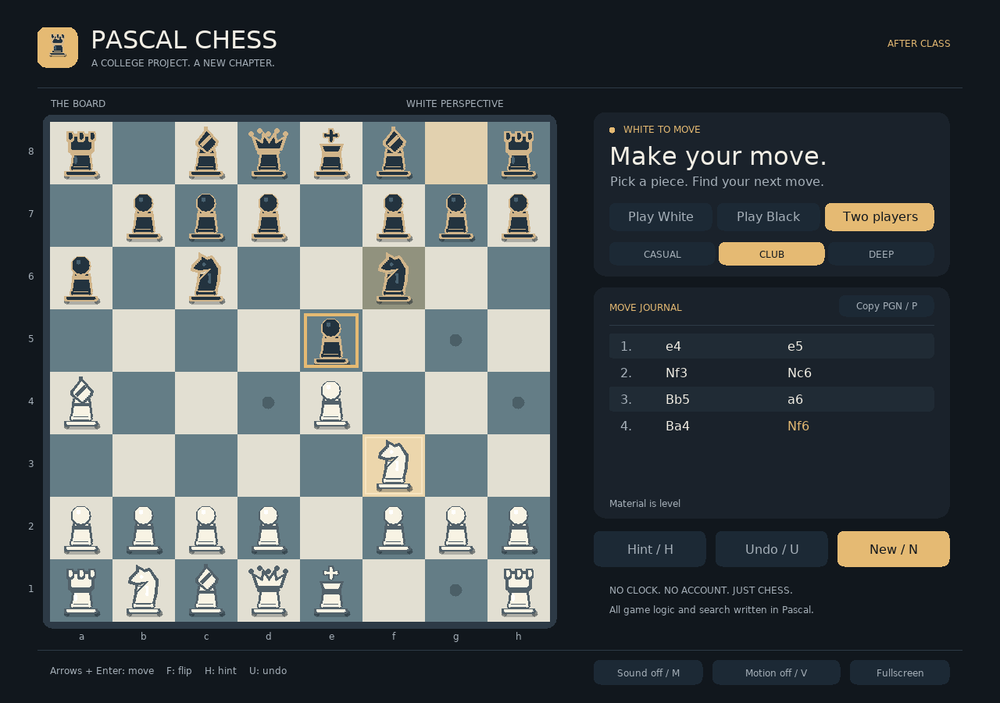

# Pascal Chess · After Class

A university exercise, revisited with a simple question: **how far could a
modern AI take this project if Pascal had to remain the foundation?**

The result is an offline native chess game. Rules, computer opponent, interface
and rule tests are written in Free Pascal. SDL2 supplies the window, drawing,
input and audio; SDL2_ttf supplies readable text.



*A reproducible renderer capture of a staged Ruy Lopez opening, not a claimed
human game or an image mockup. Run `make preview` to regenerate it.*

## Play

For the graphical edition, install Free Pascal, SDL2 and SDL2_ttf on your
desktop. On macOS with Homebrew:

```sh
brew install fpc sdl2 sdl2_ttf
make local-play
```

On Debian/Ubuntu:

```sh
sudo apt install fp-compiler make libsdl2-2.0-0 libsdl2-ttf-2.0-0 fonts-dejavu-core python3
make local-play
```

To play in a terminal with the pinned Docker toolchain:

```sh
make play
```

The desktop is a native window; the Docker game is a separate text interface.
Both use the same chess engine. There are no accounts, network requests or
automatic player files. Each game lives in memory; copy its PGN before quitting.

## On the board

- Legal moves, king safety, both castles, en passant and all four promotions.
- Human versus Pascal as either color, or two people sharing a board.
- Procedural Staunton pieces, smooth move animation, last-move/check highlights,
  legal targets, move journal, material balance and gentle synthesized sound.
- Three search budgets: Casual (6,000 nodes), Club (40,000), Deep (160,000).
  These are workload settings, **not Elo ratings**. The opponent uses Pascal
  iterative deepening, alpha-beta, quiescence and positional evaluation.
- Hints, undo, board flip, fullscreen, reduced motion, mute and focus-loss pause.
- SAN move notation, FEN positions and PGN export through the clipboard or CLI.
- Checkmate, stalemate, common insufficient-material endings, draw claims at
  threefold/50 moves and automatic fivefold/75-move draws.

Click a piece, then a highlighted square. For the keyboard, move the cursor
with arrows and press Enter to select a piece or destination. Castling means
moving the king two squares. Promotion opens a choice of queen, rook, bishop
or knight. New-game confirmation protects a game already in progress.

| Key | Action |
|---|---|
| Arrows / Enter | Navigate and select |
| H / U / N | Hint / undo / new game |
| F / F11 | Flip board / fullscreen |
| 1 / 2 / 3 | Set computer search budget |
| D | Claim an available draw |
| C / P | Copy current FEN / game PGN |
| M / V | Mute / reduced motion |
| Space | Resume after focus loss or cancelled computer search |
| Escape | Cancel selection, dialog or search |
| Q | Quit; in the promotion dialog, choose queen |

Undo against the computer returns to your previous turn. Escape can interrupt
the search without freezing the window. Copying a position or game changes the
clipboard only when requested. `CHESS_FONT` can point to another readable TTF.

## Positions and analysis

```sh
./build/chess --fen '7k/5Q2/6K1/8/8/8/8/8 w - - 0 1' --two-players
./build/ChessCLI --perft 5
./build/ChessCLI --search --nodes 40000 --depth 5
./build/ChessCLI --moves 'e2e4 e7e5 g1f3' --pgn game.pgn
```

The terminal accepts coordinate moves such as `e2e4` and `a7a8n`, plus `undo`,
`hint`, `ai`, `fen`, `pgn`, `claim`, `new`, `help` and `quit`. An explicit `--pgn`
path writes that file. Run either executable with `--help` for all options.

## Build and verify

```sh
make test image smoke
make local-build local-test local-smoke
make preview
```

The first command uses an immutable Debian image and signed APT snapshot.
The second uses your installed native dependencies. The last also needs
ImageMagick. CI runs on Linux AMD64 and ARM64; Dependabot checks Actions and
Docker weekly. A pinned APT snapshot still needs deliberate maintenance.

Read [validation](docs/validation.md) for executed checks and platform limits,
[architecture](docs/architecture.md) for the Pascal design, and
[the implementation recipe](plans/modernization.md) for replication.

## Why this repository exists

The original was a college project: one Pascal/CRT source file that drew a
board and moved pieces between coordinates. The owner revisited it with a
simple AI prompt, keeping Pascal as the creative constraint, then requested
the complete implementation and delivery flow. This is an experiment in what
an AI-assisted refactor can produce today, not proof that a particular model
is objectively the best or that the work required only one unattended step.

The [0.1.0 baseline](https://github.com/coisa/pascal-chess/releases/tag/v0.1.0)
preserves that original. [Issue #1](https://github.com/coisa/pascal-chess/issues/1)
tracks the modernization. [Origin and differences](docs/baseline.md) explain
what actually changed. Want to try your own? Start with
[the reusable college-project challenge](docs/try-your-project.md).

## Scope

This is casual standard chess, not a tournament arbiter or a rated engine.
There are no clocks, Chess960, online play, tablebases or opening books.
Draw claims cover the current position; intended-move claims are not exposed.
Dead-position detection covers standard insufficient-material cases, not every
possible blocked position. FEN validation checks structural consistency and
king safety, not proof that every imported position is historically reachable.
History holds 2,048 plies and rejects additional moves at capacity. Windows is
not a supported target. See the validation page for the tested environments.
